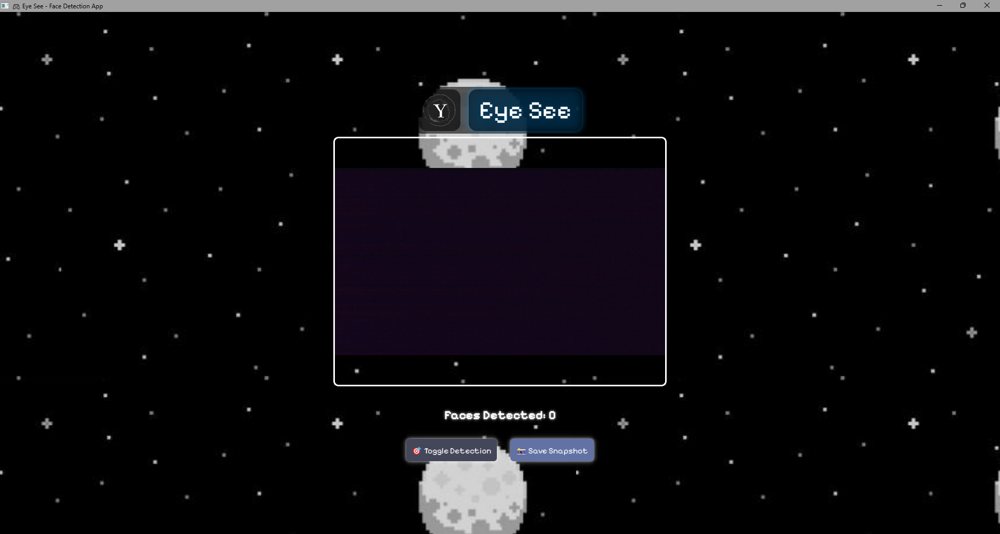
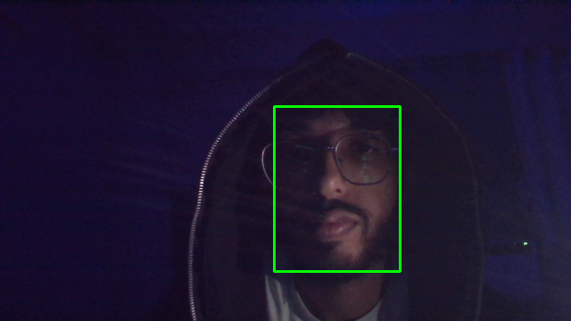
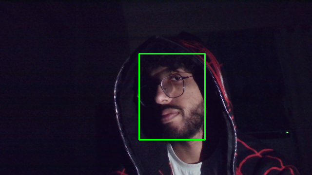
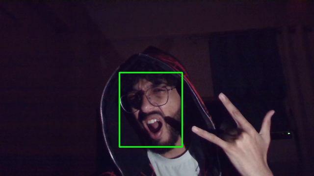
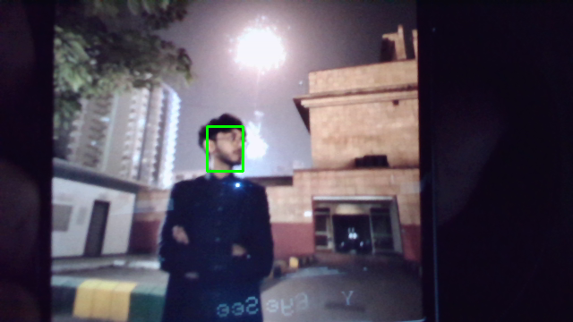
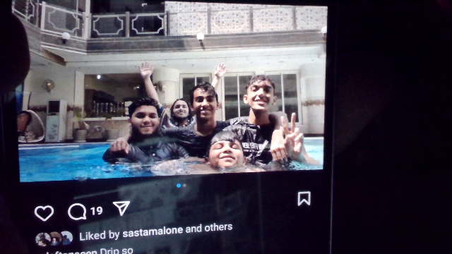
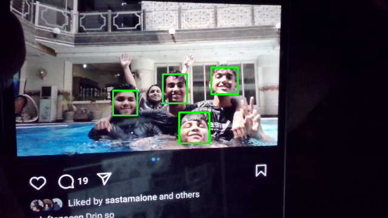

  # 👁️‍🗨️ Eye See — Real-Time Face Detection App

> A desktop application for face detection using OpenCV's DNN (deep neural network) module and a sleek PyQt5 user interface.  
> Works offline, supports multiple lighting conditions, and highlights detected faces using a fast SSD + ResNet model.

---

## 🚀 Features

- ⚡ Modern face detection using OpenCV's **DNN module** (ResNet-SSD)
- 🎮 Pixel-style **PyQt5 UI** with glowing labels and snapshot buttons
- 📸 Saves both **raw and processed** snapshots
- 🌑 Dark mode with optional pixel-art background
- 🧠 Smarter than Haar — works with side faces, low light, and phones

---

##App GUI

## 🖼️ Detection Examples

### 1. Low light detection comparison
| Original | Processed |
|----------|-----------|
|  |  |
> Low light face detection comparison showing original and processed output

---

### 2. Side profile detection
| Original | Processed |
|----------|-----------|
|  |  |

---

### 3. Detection with various poses
| Original | Processed |
|----------|-----------|
|  |  |

---

### 4. Resistant to false positives
| Original | Processed |
|----------|-----------|
|  |  |
> Doesn't detect random masks or objects with eyes

---

### 5. Phone face detection via webcam
| Original | Processed |
|----------|-----------|
|  |  |

---

### 6. Multi-face detection on phone screens
| Original | Processed |
|----------|-----------|
|  |  |

---

## 📦 Setup & Usage

1. 📁 **Clone or download** the repository
2. 🧠 Make sure you have **Python 3.13** (or compatible)
3. ✅ Run the app using the "Autorun.bat" file
